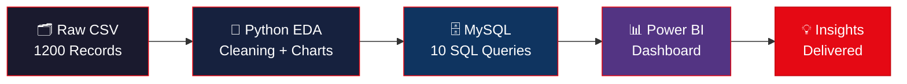

<div align="center">


<br/>

[](https://git.io/typing-svg)

<br/>


<br/><br/>

> ### 🎯 A complete end-to-end Data Analytics pipeline
> **Raw CSV → Python EDA → MySQL Database → SQL Insights → Power BI Dashboard**

</div>

---

## 🚀 Project Highlights

<div align="center">

| 🎬 | 📊 | 🗄️ | 🌍 | ⏱️ | 🔥 |
|:---:|:---:|:---:|:---:|:---:|:---:|
| **1,200** | **7** | **10** | **16** | **126 min** | **3** |
| Titles | Charts | SQL Queries | Countries | Avg Duration | Tools |

</div>

---

## 📌 Key Insights

```
╔══════════════════════════════════════════════════════════╗
║  🎬  Movies      →  827 titles  (68.9%)                 ║
║  📺  TV Shows    →  373 titles  (31.1%)                  ║
║  🌎  Top Country →  United States (336 titles)           ║
║  🎭  Top Genre   →  Children & Family Movies (96 titles) ║
║  📅  Peak Year   →  2026  (207 new titles added)         ║
║  ⭐  Top Rating  →  TV-MA (315 titles)                   ║
║  ⏱️  Avg Movie   →  126 minutes                          ║
╚══════════════════════════════════════════════════════════╝
```

---

## 🔄 Analytics Workflow



---

## 📁 Project Structure

```
📦 netflix-analytics-project
 ┣ 📂 data
 ┃ ┣ 📄 netflix_titles.csv              ← Raw dataset
 ┃ ┗ 📄 netflix_titles_cleaned.csv      ← Cleaned dataset
 ┣ 📂 python
 ┃ ┣ 🐍 generate_dataset.py             ← Dataset generation
 ┃ ┗ 🐍 analysis.py                     ← EDA + 7 charts
 ┣ 📂 sql
 ┃ ┗ 🗄️ netflix_analysis_queries.sql    ← 10 SQL queries
 ┣ 📂 powerbi
 ┃ ┗ 📋 POWERBI_GUIDE.md                ← Dashboard guide
 ┣ 📂 docs
 ┃ ┣ 🖼️ 01_content_type_distribution.png
 ┃ ┣ 🖼️ 02_top_countries.png
 ┃ ┣ 🖼️ 03_yearly_trend.png
 ┃ ┣ 🖼️ 04_top_genres.png
 ┃ ┣ 🖼️ 05_rating_distribution.png
 ┃ ┣ 🖼️ 06_movie_duration.png
 ┃ ┗ 🖼️ 07_tv_seasons.png
 ┗ 📄 README.md
```

---

## 🛠️ Tools & Skills

<div align="center">

| 🐍 Python | 🗄️ SQL | 📊 Power BI |
|:---:|:---:|:---:|
| Pandas | MySQL 8.0 | DAX Measures |
| Matplotlib | Window Functions | KPI Cards |
| Seaborn | LAG() / Aggregations | Donut Charts |
| Data Cleaning | Subqueries | Slicers |
| EDA | JOIN / GROUP BY | Interactive Dashboard |

</div>

---

## 🚀 How to Run

### 🐍 Python
```bash
# Install dependencies
pip install pandas numpy matplotlib seaborn

# Generate dataset
python python/generate_dataset.py

# Run EDA + create 7 charts
python python/analysis.py
```

### 🗄️ SQL
```sql
-- Create database
CREATE DATABASE netflix_db;
USE netflix_db;

-- Run queries from:
-- sql/netflix_analysis_queries.sql
```

### 📊 Power BI
```
1. Open Power BI Desktop
2. Get Data → Text/CSV → netflix_titles_cleaned.csv
3. Follow powerbi/POWERBI_GUIDE.md
```

---

## 📈 Sample SQL — Year over Year Growth

```sql
WITH yearly AS (
    SELECT year_added, COUNT(*) AS total
    FROM netflix_titles
    GROUP BY year_added
)
SELECT
    year_added,
    total,
    total - LAG(total) OVER (ORDER BY year_added) AS yoy_change
FROM yearly
ORDER BY year_added;
```

---

## 📸 Charts Preview

> 7 visualizations generated using Python (Matplotlib + Seaborn)

| # | Chart | Insight |
|---|-------|---------|
| 01 | 🍩 Content Type Distribution | 68.9% Movies vs 31.1% TV Shows |
| 02 | 🌍 Top Countries | US leads with 336 titles |
| 03 | 📈 Yearly Trend | Growth from 2008 → 2026 |
| 04 | 🎭 Top Genres | Children & Family dominates |
| 05 | ⭐ Rating Distribution | TV-MA most common |
| 06 | ⏱️ Movie Duration | Avg 126 min histogram |
| 07 | 📺 TV Seasons | Season count breakdown |

---

<div align="center">

## 👩‍💻 Author


[](https://github.com/thangam2630)

**⭐ Star this repo if you found it useful!**

</div>
